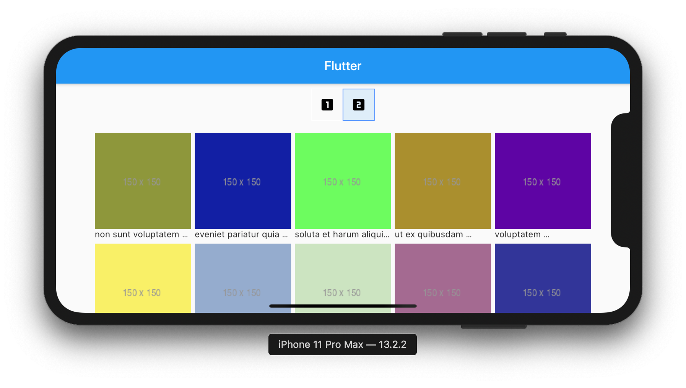

# Flutter Responsive UI

This is a responsive flutter starter project 

## Getting Started

This is a simple flutter project that gives user the option to choose either portrait or landscape view of list of albums.
Fetched from [https://jsonplaceholder.typicode.com](https://jsonplaceholder.typicode.com) - a fake API provider.
There are three (3) build environment [DEVELOPMENT, PRODUCTION, QA]

## 💻 Requirements
* Any Operating System (ie. MacOS X, Linux, Windows)
* Any IDE with Flutter SDK installed (ie. IntelliJ, Android Studio, VSCode etc)
* A little knowledge of Dart and Flutter
* A brain to think 🤓🤓

## ✨ Features
- [x] Portrait View.
- [x] Landscape View.

## 📸 ScreenShots

## Portrait

## Landscape

## 🔌 Plugins
| Name | Usage |
|------|-------|
|[**Scoped Model**](https://pub.dev/packages/scoped_model)| State Management|
|[**Connectivity**](https://pub.dev/packages/connectivity)| Internet Connection|
|[**Provider**](https://pub.dev/packages/provider)| Listening to Instant Internet Connection Changes|
|[**GetIt**](https://pub.dev/packages/get_it)| Service Locator |
|[**Http**](https://pub.dev/packages/http)| HTTP Requests|

## 🤓 Author
**Emmanuel Iwearu** 
